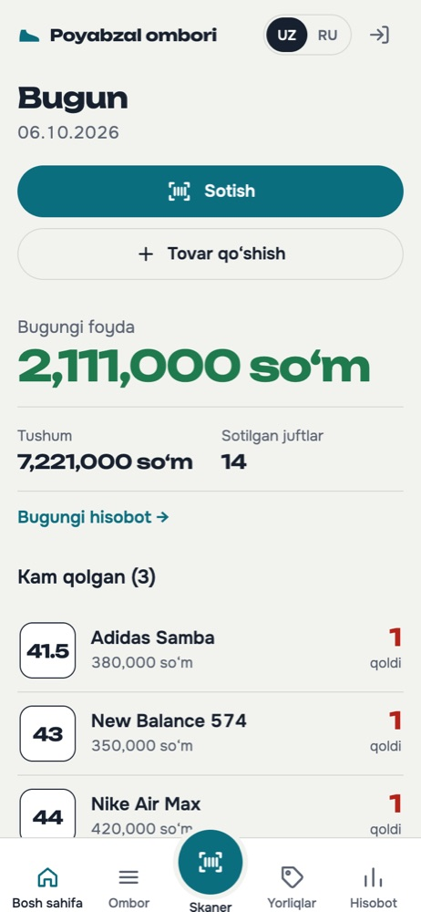
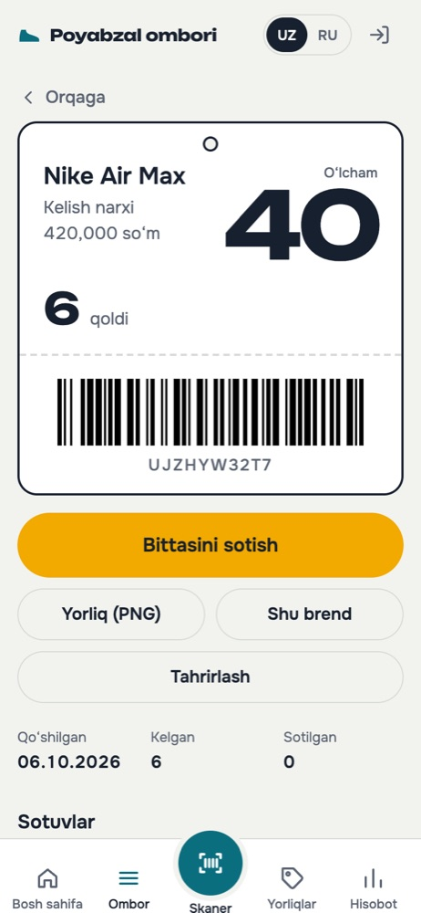
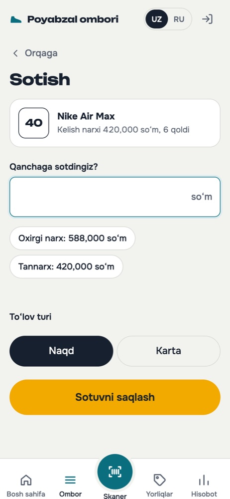
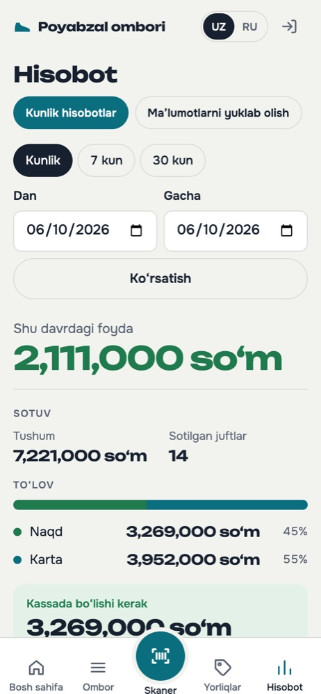

# ShopInventory

[](https://github.com/sanjarbek-ashurboyev/ShopInventory/actions/workflows/tests.yml)

Inventory and point-of-sale system for a shoe shop, built to be used from a phone behind
the counter. Staff add deliveries, print barcode labels, scan a box with the phone camera
to sell it, and see the day's profit and cash-drawer total at closing.

A Django REST Framework API with a React + TypeScript frontend. The interface is in
Uzbek and Russian; the code and this document are in English.

| Home | Product & barcode | Selling | Daily report |
|---|---|---|---|
|  |  |  |  |

> Screenshots use generated demo data.

---

## Features

- **Stock by size.** Each delivery is recorded by brand, purchase price and size. Every
  size gets its own barcode. A top-up at the same price merges into the existing line
  and keeps its barcode; a different price gets a new line, so profit stays exact.
- **Barcode labels.** Print a sheet of labels as a PDF, or download a single label as PNG.
- **Scan to sell.** Scan a label with the phone camera, enter the price, pick cash or
  card. Stock is decremented atomically, so the same last pair can never be sold twice.
- **Reports.** Today's profit, revenue and pairs sold; any date range; the cash vs card
  split and how much cash should be in the drawer.
- **Exports.** Inventory and sales as CSV or Excel, and a daily report as `.xlsx`.
- **Low-stock list** on the home screen.
- **Owner and seller roles.** Sellers find stock, sell and print labels. Purchase prices,
  profit, reports, exports and adding, editing or deleting stock are for owners only. The
  API leaves those fields out of sellers' responses and refuses the endpoints with 403;
  the app hides them too.
- **Two languages:** Uzbek and Russian, switchable at any time.

### Security
- JWT authentication with refresh-token rotation and blacklisting on logout.
- Changing a password logs the user out on every device.
- Login rate limiting (10 per minute), and the Django admin locks for 15 minutes after
  5 wrong passwords.
- Exported spreadsheets are protected against formula injection.
- In production the app refuses to start without a secret key and allowed hosts.

## Tech stack

| Layer | Tools |
|---|---|
| API | Python, Django, Django REST Framework, SimpleJWT, django-filter, drf-spectacular |
| Documents | python-barcode, Pillow, ReportLab (PDF), openpyxl (Excel) |
| Frontend | React 19, TypeScript, Vite, TanStack Query, React Router, Quagga2 (camera scanning) |
| Data | PostgreSQL in production, SQLite for local development |
| Deployment | Docker Compose, Gunicorn, WhiteNoise, nginx |

## Tests

71 tests cover stock merging, selling, reports, exports, the security rules and what each role can see and do.

```bash
DJANGO_DEBUG=1 python manage.py collectstatic --noinput
DJANGO_DEBUG=1 python manage.py test
```

## Running locally

Requirements: Python 3.14 and Node.js 24.

```bash
git clone https://github.com/sanjarbek-ashurboyev/ShopInventory.git
cd ShopInventory

# API on :8000. Uses SQLite when DATABASE_URL is not set.
python3 -m venv .venv
.venv/bin/pip install -r requirements.txt
export DJANGO_DEBUG=1
.venv/bin/python manage.py migrate
.venv/bin/python manage.py createsuperuser
.venv/bin/python manage.py runserver

# Frontend on :5173, in a second terminal. Proxies /api to Django.
cd frontend
npm ci
npm run dev          # or `npm run dev:phone` for HTTPS, so a phone camera works
```

API docs: http://127.0.0.1:8000/api/docs/

## Deployment

Runs as Docker containers (Django + Gunicorn, PostgreSQL, and nginx serving the React
build). The full guide, including HTTPS, backups and updates, is in [DEPLOY.md](DEPLOY.md).

## Known limitations

- **Roles are managed in the Django admin.** An owner is a superuser or a member of the
  `owners` group; every other account is a seller. Accounts that existed before roles were
  added were made owners. There is no screen in the app for managing staff yet.
- **Sellers can sell below cost.** They don't see the purchase price, so they can't tell. The
  owner sees the loss in the reports afterwards.
- **A mistaken sale can only be undone in the Django admin.** The API's sales history is
  read-only; deleting a sale in the admin puts the pair back in stock.
- **The tests run on SQLite only.** Selling the last pair is a single atomic `UPDATE`, but
  that guarantee is not yet tested against PostgreSQL with concurrent requests
  ([#1](https://github.com/sanjarbek-ashurboyev/ShopInventory/issues/1)) ([#2](https://github.com/sanjarbek-ashurboyev/ShopInventory/issues/2)).

## License

[MIT](LICENSE)
